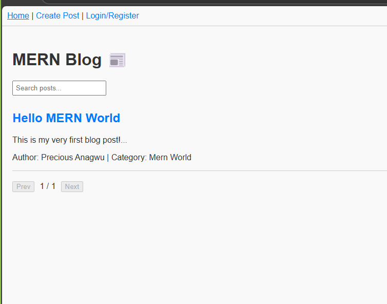

# MERN Blog 📰

A full-stack **MERN (MongoDB, Express.js, React.js, Node.js) Blog Application** that demonstrates CRUD operations, user authentication, image uploads, comments, pagination, and search functionality.

---

## Table of Contents

* [Project Overview](#project-overview)
* [Features](#features)
* [Project Structure](#project-structure)
* [Setup Instructions](#setup-instructions)
* [Environment Variables](#environment-variables)
* [Running the Application](#running-the-application)
* [API Documentation](#api-documentation)
* [Future Improvements](#future-improvements)

---

## Project Overview

This project is a MERN stack blog platform that allows users to:

* Create, read, update, and delete blog posts
* Register and login for protected actions
* Upload featured images for posts
* Categorize posts and filter them
* Comment on posts
* Search posts and paginate results

It serves as a full-stack integration assignment demonstrating the interaction between a React frontend and an Express/MongoDB backend.

---

## Features

**Implemented:**

* User authentication (register/login)
* CRUD operations for posts
* CRUD operations for categories
* Comments on posts
* Image uploads for posts
* Search posts by title or content
* Pagination of posts
* Responsive frontend with React and Vite
* API error handling and input validation
* State management using React hooks

---

## Project Structure

```
project-root/
│
├─ client/                 # React frontend (Vite)
│  ├─ src/
│  │  ├─ components/       # React components (Home, PostForm, PostDetail, Navbar, LoginRegister, Pagination)
│  │  ├─ hooks/            # Custom hooks (e.g., useApi.js)
│  │  ├─ App.jsx
│  │  ├─ main.jsx
│  │  └─ index.css
│
├─ server/                 # Express backend
│  ├─ config/              # MongoDB connection (db.js)
│  ├─ models/              # Mongoose models (User, Post, Category, Comment)
│  ├─ routes/              # Express routes
│  ├─ middleware/          # Auth, errorHandler
│  ├─ uploads/             # Uploaded images
│  └─ index.js             # Main server entry
│
├─ .env                    # Environment variables
└─ package.json
```

---

## Setup Instructions

1. **Clone the repository:**

```bash
git clone <your-repo-url>
cd <repo-folder>
```

2. **Install dependencies for backend and frontend:**

```bash
# Backend
cd server
npm install

# Frontend
cd ../client
npm install
```

3. **Create `.env` files:**

**Server `.env`:**

```
PORT=5000
MONGO_URI=<your_mongo_connection_string>
JWT_SECRET=<your_jwt_secret>
CLIENT_URL=http://localhost:5173
```

**Client `.env`:**

```
VITE_API_URL=http://localhost:5000/api
VITE_CLIENT_URL=http://localhost:5173
```

4. **Run backend server:**

```bash
cd server
npm run dev
```

5. **Run frontend:**

```bash
cd client
npm run dev
```

6. Open browser at [http://localhost:5173](http://localhost:5173)

---

## API Documentation

### Authentication

* `POST /api/auth/register` → Register new user
* `POST /api/auth/login` → Login user and get JWT

### Posts

* `GET /api/posts` → Get all posts (supports `search`, `category`, `page`, `limit`)
* `GET /api/posts/:id` → Get post by ID
* `POST /api/posts` → Create new post (protected, with image upload)
* `PUT /api/posts/:id` → Update post (protected)
* `DELETE /api/posts/:id` → Delete post (protected)

### Categories

* `GET /api/categories` → List all categories
* `POST /api/categories` → Create category (protected)

### Comments

* `GET /api/comments/:postId` → Get comments for a post
* `POST /api/comments/:postId` → Add comment to a post (protected)

---

## Features Implemented

* ✅ CRUD for posts, categories, comments
* ✅ User authentication (JWT protected routes)
* ✅ Image uploads for posts
* ✅ Pagination and search functionality
* ✅ React frontend with hooks, router, and state management
* ✅ Input validation & error handling
* ✅ Responsive UI with basic styling

---

## Screenshots

### Home Page


---

**Author:** Anagwu Precious Chinemerem
**Date:** 2025-11-03
